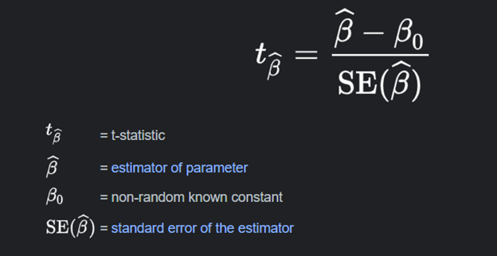
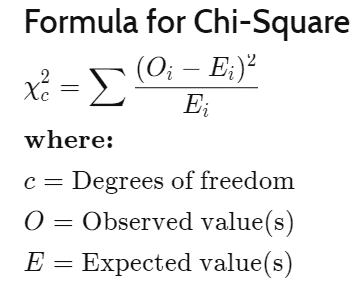

# Inferential_Statistics
## About Dataset
### Marketing companies want to run successful campaigns, but the market is complex and several options can work. So normally they tun A/B tests, that is a randomized experimentation process wherein two or more versions of a variable (web page, page element, banner, etc.) are shown to different segments of people at the same time to determine which version leaves the maximum impact and drive business metrics.
### The companies are interested in answering one questions:
### If the campaign was successful, how much of that success could be attributed to the ads?
### With the second question in mind, we normally do an A/B test. The majority of the people will be exposed to ads (the experimental group). And a small portion of people (the control group) would instead see a Public Service Announcement (PSA) (or nothing) in the exact size and place the ad would normally be.
### The idea of the dataset is to analyze the groups, find if the ads were successful, how much the company can make from the ads, and if the difference between the groups is statistically significant.
## Columns
<ul>
    <li>Index: Row index</li>
    <li>user id: User ID (unique)</li>
    <li>test group: If "ad" the person saw the advertisement, if "psa" they only saw the public service announcement</li>
    <li>converted: If a person bought the product then True, else is False</li>
    <li>total ads: Amount of ads seen by person</li>
    <li>most ads day: Day that the person saw the biggest amount of ads</li>
    <li>most ads hour: Hour of day that the person saw the biggest amount of ads</li>
</ul>

## In this project, Using inferential statistics, We have validated the effect of viewing advertisements on the purchase of users of a market.

## T-test Independent on ad & psa group
### The independent t-test, also called the two sample t-test, independent-samples t-test or student's t-test, is an inferential statistical test that determines whether there is a statistically significant difference between the means in two unrelated groups.

## Chi_Square Test
### Chi-square analysis is applied to categorical variables and is especially useful when those variables are nominal (where order doesn't matter, like marital status or gender).

## Final Solution
### The chi-squared statistic of 54.005823883685245 is much larger than the critical value of 3.841, which is the cutoff for significance at the 0.05 level. This means that the difference between the two conversion rates is very likely to be real and not due to chance.
### The p-value of 1.9989623063390075e-13 is also very small. This means that there is a very small probability that the difference between the two conversion rates could have occurred by chance.
### In other words, the chi-squared statistic and p-value suggest that there is strong evidence to conclude that there is a significant difference between the ad conversion rate and the PSA conversion rate.
### In your case, the chi-squared statistic is greater than the critical value and the p-value is much less than 0.05, so you can conclude that the difference between the two conversion rates is significant at the 0.05 level.
